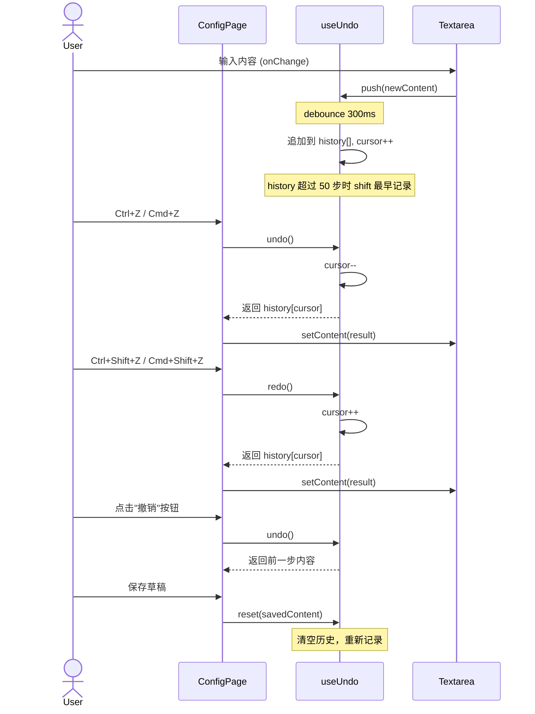
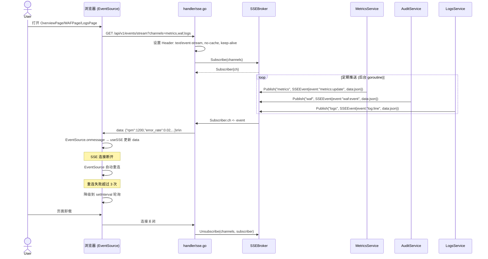
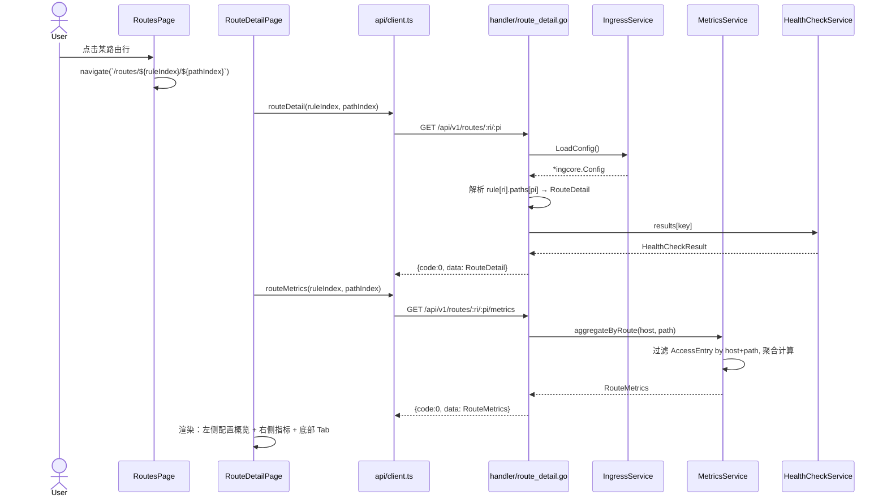
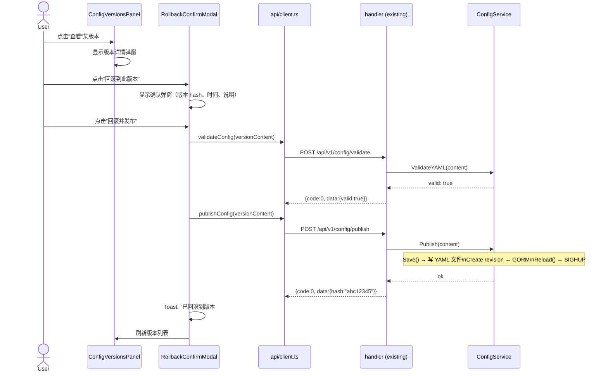
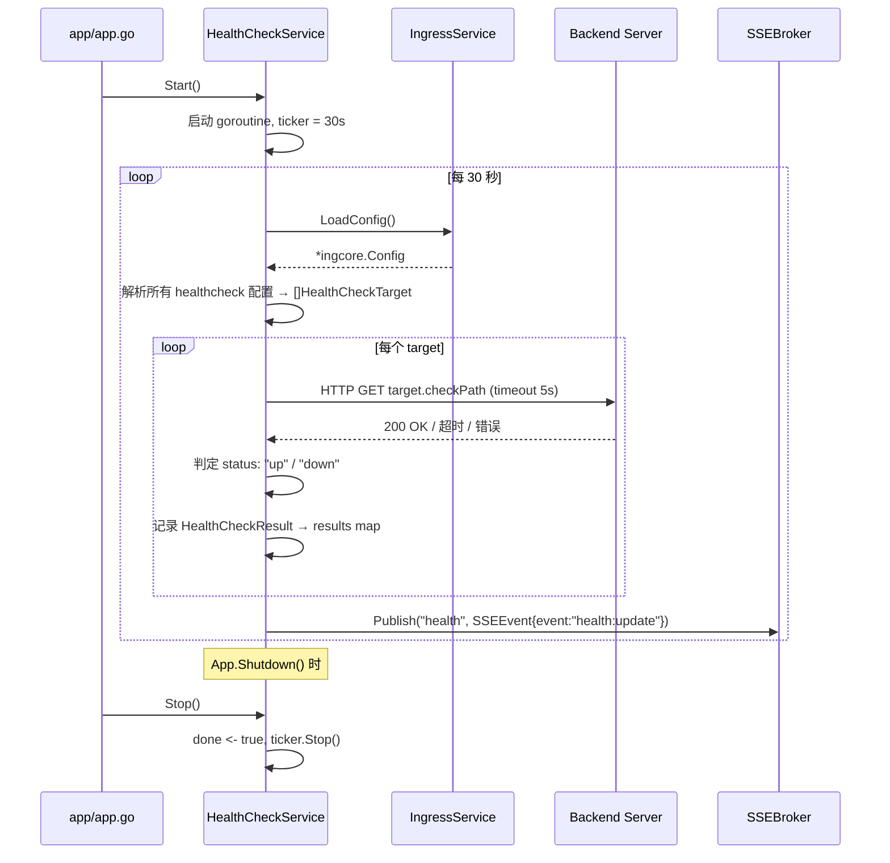
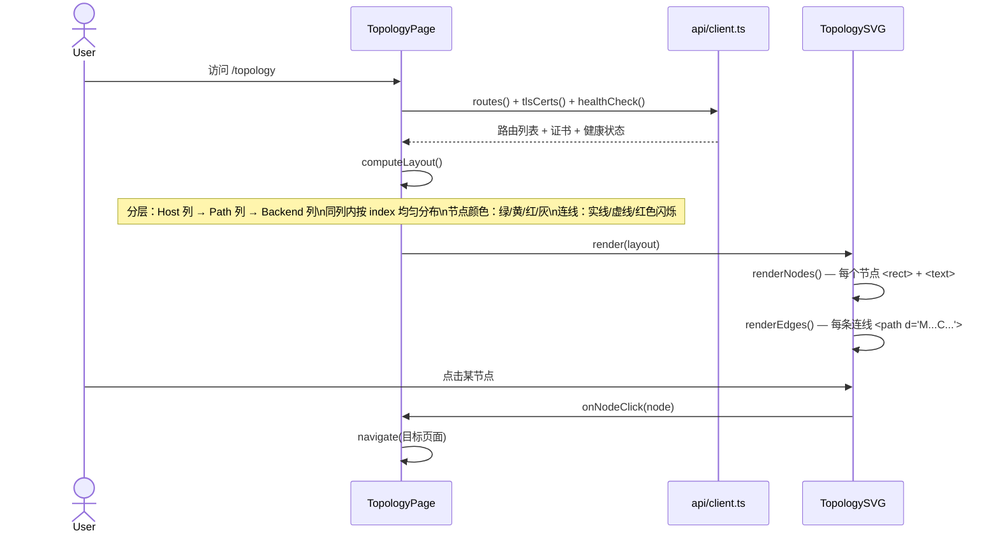
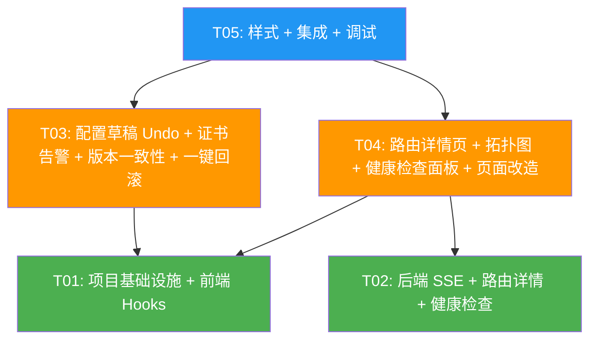

# Admin Console 易用性提升 — 系统架构设计

## 1. 实现方案 & 框架选型

### 1.1 核心技术挑战

| 挑战 | 分析 | 应对策略 |
|------|------|----------|
| SSE 与 zoox 框架兼容 | zoox 基于 `net/http`，需设置 streaming header 后持续写入 `http.ResponseWriter`；不能使用 `ctx.JSON()` 等一次性写入方法 | 直接通过 `ctx.Request.Context()` 获取 cancel 信号，用 `http.Flusher` 逐帧推送 |
| useUndo 与双向编辑器同步 | YAML textarea 和可视化模块编辑器共享同一个 content state，undo/redo 需要同时作用于两者 | 统一通过 `useUndo` 管理 content 字符串，两个编辑器的 onChange 均走 `undo.push()` |
| 纯 SVG 拓扑图布局 | 三层（Host→Path→Backend）DAG 布局，节点数可能 >50，需要自动排列避免重叠 | 自研分层布局算法：按层级分列，同列内按 index 均匀分布，连线用三次贝塞尔曲线 |
| 路由详情页多维数据聚合 | 需要组合 routes/config/metrics/logs/waf/cache/healthcheck 共 7 个数据源 | 后端提供聚合 API `GET /routes/:ri/:pi`，一次返回路由完整配置；前端并行请求指标+事件流 |
| 健康检查长期运行 | 需要后台持续探测，不能阻塞 HTTP handler | 使用 Go goroutine + `time.Ticker`（30s 间隔），不用 cron 库，结果存内存 map |

### 1.2 框架与库选型

| 用途 | 选型 | 理由 |
|------|------|------|
| 前端框架 | React 19 + TypeScript + Vite | 现有项目已使用，无需迁移 |
| UI 样式 | 纯手写 CSS（暗色主题） | 项目约定：零外部 UI 库 |
| 拓扑图 | 纯 SVG（React JSX 内联） | 项目约定：零外部图形/图表库 |
| SSE 客户端 | 浏览器原生 `EventSource` | 无需额外依赖，自动重连 |
| Undo 机制 | 自研 `useUndo` hook | 需求简单，无需 immutable.js 等库 |
| 后端框架 | go-zoox/zoox | 现有项目已使用 |
| ORM | GORM + SQLite | 现有项目已使用 |
| HTTP 探测 | Go `net/http` 标准库 | 健康检查探测只需简单 GET |
| 定时任务 | Go goroutine + `time.Ticker` | 约束：不用 cron 库 |

### 1.3 架构模式

- **前端**：单页应用（SPA），基于 React Router v6 的声明式路由，状态管理使用组件内 `useState/useReducer`，无全局状态库
- **后端**：MVC 变体 — `handler`（Controller）→ `service`（业务逻辑）→ `model`（GORM 模型），路由通过 zoox 的 `Group` 组织
- **数据流**：请求驱动（REST API）+ 事件驱动（SSE）混合模式

---

## 2. 文件清单

> 格式：`M/N` 表示第 M 个新增/修改文件，共 N 个

### 新增文件（13/N）

| # | 路径 | 说明 |
|---|------|------|
| 1/13 | `core/admin/web/src/hooks/useUndo.ts` | Undo/Redo 自定义 hook，50 步历史栈，debounce 300ms |
| 2/13 | `core/admin/web/src/hooks/useSSE.ts` | SSE 连接管理 hook，自动重连 + 降级到轮询 |
| 3/13 | `core/admin/web/src/pages/RouteDetailPage.tsx` | 路由详情页：左右布局 + 底部 Tab |
| 4/13 | `core/admin/web/src/pages/TopologyPage.tsx` | 拓扑/服务关系图页，纯 SVG 渲染 |
| 5/13 | `core/admin/web/src/pages/HealthPage.tsx` | 健康检查面板页 |
| 6/13 | `core/admin/web/src/components/TopologySVG.tsx` | 拓扑图 SVG 组件：分层布局 + 节点 + 连线 |
| 7/13 | `core/admin/web/src/components/RollbackConfirmModal.tsx` | 一键回滚确认弹窗 |
| 8/13 | `core/admin/web/src/components/VersionConsistencyBadge.tsx` | 版本一致性标识组件 |
| 9/13 | `core/admin/handler/sse.go` | SSE handler：统一流端点 `/events/stream` |
| 10/13 | `core/admin/handler/route_detail.go` | 路由详情 handler：`/routes/:ri/:pi` 和 `/routes/:ri/:pi/metrics` |
| 11/13 | `core/admin/handler/health.go` | 健康检查 handler：`/healthcheck` |
| 12/13 | `core/admin/service/healthcheck.go` | 健康检查 service：goroutine 定期探测 + 状态存储 |
| 13/13 | `core/admin/service/sse_broker.go` | SSE Broker：频道订阅/发布，管理客户端连接 |

### 修改文件（12/N）

| # | 路径 | 修改内容 |
|---|------|----------|
| 1/12 | `core/admin/web/src/App.tsx` | 新增路由：`/routes/:ruleIndex/:pathIndex`、`/topology`、`/health` |
| 2/12 | `core/admin/web/src/api/client.ts` | 新增 API 方法：`routeDetail()`、`routeMetrics()`、`healthCheck()`、SSE URL helper；新增类型定义 |
| 3/12 | `core/admin/web/src/pages/OverviewPage.tsx` | 替换 `certWarn=0` 为 TLS 真实数据；新增版本一致性卡片；SSE 替代 metrics 轮询 |
| 4/12 | `core/admin/web/src/pages/ConfigPage.tsx` | 集成 `useUndo` hook；新增撤销/重做按钮；增强 draft badge |
| 5/12 | `core/admin/web/src/pages/RoutesPage.tsx` | 行点击跳转到 `/routes/:ruleIndex/:pathIndex` |
| 6/12 | `core/admin/web/src/pages/WAFPage.tsx` | SSE 替代 `setInterval` 轮询 |
| 7/12 | `core/admin/web/src/pages/LogsPage.tsx` | SSE 替代日志增量轮询 |
| 8/12 | `core/admin/web/src/components/ConfigVersionsPanel.tsx` | 新增"回滚到此版本"按钮 + 确认弹窗 |
| 9/12 | `core/admin/web/src/layout/AppLayout.tsx` | 侧边栏新增"拓扑"和"健康检查"入口 |
| 10/12 | `core/admin/web/src/styles/app.css` | 新增样式：路由详情页、拓扑页、健康检查页、回滚弹窗、版本一致性 badge |
| 11/12 | `core/admin/handler/api.go` | 注册新路由：SSE stream、route detail、route metrics、healthcheck |
| 12/12 | `core/admin/app/app.go` | 初始化 HealthCheck service 和 SSE Broker，注入到 API |

---

## 3. 数据结构与接口

```mermaid
classDiagram

    %% ===== 前端 Hooks =====
    class useUndo {
        +history: string[]
        +cursor: number
        +maxSize: number = 50
        +debounceMs: number = 300
        +push(value: string) void
        +undo() string
        +redo() string
        +canUndo: boolean
        +canRedo: boolean
        +reset(value: string) void
    }

    class useSSE {
        +url: string
        +channels: string[]
        +data: Record~string, unknown~
        +connected: boolean
        +error: Error | null
        +fallbackPolling: boolean
        -es: EventSource | null
        -reconnectTimer: number
        +close() void
    }

    %% ===== 前端页面组件 =====
    class RouteDetailPage {
        +ruleIndex: number
        +pathIndex: number
        +detail: RouteDetail
        +metrics: RouteMetrics
        +activeTab: string
        -loadDetail() Promise
        -loadMetrics() Promise
    }

    class TopologyPage {
        +routes: RouteRow[]
        +healthMap: Map~string, HealthStatus~
        +certs: TLSCert[]
        +svgWidth: number
        +svgHeight: number
        -computeLayout() TopologyLayout
    }

    class HealthPage {
        +checks: HealthCheckResult[]
        +summary: HealthSummary
        -loadChecks() Promise
    }

    %% ===== 前端子组件 =====
    class TopologySVG {
        +layout: TopologyLayout
        +onNodeClick(node: TopologyNode) void
        -renderNodes() JSX.Element[]
        -renderEdges() JSX.Element[]
        -bezierPath(from: Point, to: Point) string
    }

    class RollbackConfirmModal {
        +revision: ConfigRevisionSummary
        +diffSummary: string
        +onConfirm() void
        +onCancel() void
        +loading: boolean
    }

    class VersionConsistencyBadge {
        +runningHash: string
        +latestHash: string
        +consistent: boolean
    }

    %% ===== 后端 Handler =====
    class SSEHandler {
        +broker: SSEBroker
        +Stream(ctx: *zoox.Context) void
    }

    class RouteDetailHandler {
        +ingressSvc: *IngressService
        +metricsSvc: *MetricsService
        +healthSvc: *HealthCheckService
        +GetDetail(ctx: *zoox.Context) void
        +GetMetrics(ctx: *zoox.Context) void
    }

    class HealthHandler {
        +healthSvc: *HealthCheckService
        +ListChecks(ctx: *zoox.Context) void
    }

    %% ===== 后端 Service =====
    class SSEBroker {
        +subscribers: Map~string, Set~Subscriber~~
        +mu: sync.RWMutex
        +Subscribe(channels: string[]) Subscriber
        +Unsubscribe(channels: string[], sub: Subscriber) void
        +Publish(channel: string, event: SSEEvent) void
        +Start() void
    }

    class HealthCheckService {
        +results: Map~string, *HealthCheckResult~
        +mu: sync.RWMutex
        +ticker: *time.Ticker
        +done: chan bool
        +client: *http.Client
        +ingressSvc: *IngressService
        +Start() void
        +Stop() void
        +check(backend: HealthCheckTarget) HealthCheckResult
        +ListResults() []HealthCheckResult
    }

    %% ===== 数据模型 =====
    class RouteDetail {
        +ruleIndex: number
        +pathIndex: number
        +host: string
        +path: string
        +backend: BackendInfo
        +auth: AuthInfo | null
        +cache: CacheInfo | null
        +healthCheck: HealthCheckInfo | null
        +waf: WAFInfo | null
    }

    class RouteMetrics {
        +window: string
        +rpm: number
        +errorRate: number
        +p50: number
        +p95: number
        +cacheHitRate: number
        +timeline: TimelinePoint[]
    }

    class HealthCheckResult {
        +key: string
        +host: string
        +path: string
        +backend: string
        +url: string
        +status: string
        +lastCheck: time.Time
        +responseMs: number
        +error: string
    }

    class HealthCheckTarget {
        +host: string
        +path: string
        +backend: string
        +method: string
        +checkPath: string
        +expectedStatus: int
        +expectedBody: string
    }

    class SSEEvent {
        +event: string
        +data: string
        +id: string
        +retry: number
    }

    class Subscriber {
        +ch: chan SSEEvent
        +channels: string[]
        +closed: bool
    }

    class HealthSummary {
        +total: number
        +up: number
        +down: number
        +unknown: number
    }

    class TopologyNode {
        +id: string
        +type: string
        +label: string
        +x: number
        +y: number
        +status: string
        +meta: Record~string, unknown~
    }

    class TopologyEdge {
        +from: string
        +to: string
        +style: string
    }

    class TopologyLayout {
        +nodes: TopologyNode[]
        +edges: TopologyEdge[]
        +width: number
        +height: number
    }

    %% ===== 关系 =====
    RouteDetailPage --> RouteDetail : fetches
    RouteDetailPage --> RouteMetrics : fetches
    RouteDetailPage --> useSSE : uses
    TopologyPage --> TopologySVG : renders
    TopologyPage --> TopologyLayout : computes
    TopologySVG --> TopologyNode : renders
    TopologySVG --> TopologyEdge : renders
    HealthPage --> HealthCheckResult : lists
    HealthPage --> HealthSummary : displays
    ConfigPage --> useUndo : uses
    OverviewPage --> useSSE : uses
    WAFPage --> useSSE : uses
    LogsPage --> useSSE : uses

    SSEHandler --> SSEBroker : uses
    RouteDetailHandler --> HealthCheckService : reads
    HealthHandler --> HealthCheckService : reads
    HealthCheckService --> HealthCheckTarget : probes
    HealthCheckService --> HealthCheckResult : produces
    SSEBroker --> Subscriber : manages
    SSEBroker --> SSEEvent : publishes
```



---

## 4. 程序调用流程

### 4.1 配置草稿 Undo 流程



### 4.2 SSE 实时推送流程



### 4.3 路由详情页加载流程



### 4.4 一键回滚流程



### 4.5 健康检查探测流程



### 4.6 拓扑图渲染流程



---

## 5. 待确认问题 & 假设

| # | 问题 | 假设/建议 |
|---|------|-----------|
| 1 | SSE 并发连接数限制 | 后端限制单 IP 最多 5 个 SSE 连接，超出时返回 429 |
| 2 | Undo 栈深度 | 默认 50 步，超过时 `history.shift()` 丢弃最早记录 |
| 3 | 路由指标按 host+path 过滤的性能 | 当前访问日志 < 10000 行/15min，逐行匹配可接受；后续如有性能问题再引入内存缓存 |
| 4 | 健康检查探测频率 | 30s 间隔，探测超时 5s，使用 Go goroutine + time.Ticker |
| 5 | 拓扑图节点数量 | 纯 SVG 在节点 < 100 时性能可接受；不引入 dagre/elk 等布局库 |
| 6 | 一键回滚确认方式 | 弹窗确认即可，不需二次输入版本号；回滚后自动 reload |
| 7 | 路由详情页 URL | 使用 `ruleIndex/pathIndex`，接受配置变更后 URL 可能失效的风险 |
| 8 | SSE 在 zoox 框架中的实现 | 假设 zoox 支持直接操作 `http.ResponseWriter` 进行 streaming（通过 `ctx.Writer` 或类似机制） |

---

## 6. 依赖包

### 前端（零新增依赖）

无需新增 npm 包。所有功能基于 React 19 + TypeScript + 浏览器原生 API（EventSource、SVG）实现。

### 后端（零新增依赖）

无需新增 Go 模块。所有功能基于标准库（`net/http`、`time`、`sync`）+ 现有 zoox 框架实现。

---

## 7. 任务分解

### T01：项目基础设施 + 前端 Hooks

**优先级**：P0  
**源文件**：
- `core/admin/web/src/hooks/useUndo.ts` (新增)
- `core/admin/web/src/hooks/useSSE.ts` (新增)
- `core/admin/web/src/api/client.ts` (修改 — 新增类型定义和 API 方法)
- `core/admin/web/src/App.tsx` (修改 — 新增路由定义)

**依赖**：无  
**说明**：
- 实现 `useUndo` hook：50 步历史栈、debounce 300ms、undo/redo/reset 方法、canUndo/canRedo 派生状态
- 实现 `useSSE` hook：EventSource 连接管理、自动重连（最多 3 次）、降级到 setInterval 轮询、页面卸载自动关闭
- 扩展 `api/client.ts`：新增类型 `RouteDetail`、`RouteMetrics`、`HealthCheckResult`、`HealthSummary`；新增方法 `routeDetail(ri, pi)`、`routeMetrics(ri, pi)`、`healthCheck()`、SSE URL helper
- 修改 `App.tsx`：新增路由 `RouteDetailPage`（`/routes/:ruleIndex/:pathIndex`）、`TopologyPage`（`/topology`）、`HealthPage`（`/health`）

### T02：后端 SSE + 路由详情 + 健康检查

**优先级**：P0  
**源文件**：
- `core/admin/service/sse_broker.go` (新增)
- `core/admin/service/healthcheck.go` (新增)
- `core/admin/handler/sse.go` (新增)
- `core/admin/handler/route_detail.go` (新增)
- `core/admin/handler/health.go` (新增)
- `core/admin/handler/api.go` (修改 — 注册新路由)
- `core/admin/app/app.go` (修改 — 初始化 service)

**依赖**：无（与 T01 并行开发）  
**说明**：
- 实现 `SSEBroker`：频道订阅/发布、Subscriber 管理（map + sync.RWMutex）、Publish 广播、单 IP 连接数限制（5）
- 实现 SSE handler：`GET /api/v1/events/stream?channels=metrics,waf,logs,health`，设置 streaming header，循环读取 Subscriber.ch 并写入 `ctx.Writer` + Flush，监听 `ctx.Request.Context().Done()` 退出
- 实现路由详情 handler：`GET /api/v1/routes/:ri/:pi` 解析配置返回 RouteDetail；`GET /api/v1/routes/:ri/:pi/metrics` 按 host+path 过滤 AccessEntry 聚合指标
- 实现健康检查 service：goroutine + time.Ticker（30s 间隔）+ http.Client（5s 超时），解析配置中 healthcheck 字段生成 target 列表，探测结果存 `sync.Map`，状态变更时 Publish 到 SSE
- 实现健康检查 handler：`GET /api/v1/healthcheck` 返回所有探测结果 + 汇总
- 修改 `api.go`：注册新路由，注入新 service 到 API struct
- 修改 `app.go`：初始化 HealthCheckService 和 SSEBroker，启动 goroutine，注册 shutdown hook

### T03：配置草稿 Undo + 证书告警 + 版本一致性 + 一键回滚

**优先级**：P0  
**源文件**：
- `core/admin/web/src/pages/ConfigPage.tsx` (修改)
- `core/admin/web/src/pages/OverviewPage.tsx` (修改)
- `core/admin/web/src/components/ConfigVersionsPanel.tsx` (修改)
- `core/admin/web/src/components/RollbackConfirmModal.tsx` (新增)
- `core/admin/web/src/components/VersionConsistencyBadge.tsx` (新增)

**依赖**：T01（useUndo hook、API client 类型）  
**说明**：
- **P0-1 配置草稿 Undo**：ConfigPage 集成 `useUndo` hook，textarea onChange → `undo.push()`，Ctrl+Z/Cmd+Z → `undo.undo()`，Ctrl+Shift+Z/Cmd+Shift+Z → `undo.redo()`，新增撤销/重做按钮（图标+tooltip），增强 draft badge 显示变更计数
- **P0-2 证书到期告警**：OverviewPage 调用 `api.tlsCerts()` 获取证书列表，计算 `certWarn = certs.filter(c => c.days_remaining < 30).length`，替换硬编码 `certWarn=0`，分级显示（绿/黄/红）
- **P1-3 一键回滚**：ConfigVersionsPanel 新增"回滚到此版本"按钮 → 弹出 RollbackConfirmModal → 确认后依次调用 `api.validateConfig()` → `api.publishConfig()` → 刷新页面
- **P2-2 版本一致性**：VersionConsistencyBadge 组件，对比运行版本 hash 与最新保存版本 hash，不一致标黄

### T04：路由详情页 + 拓扑图 + 健康检查面板 + 页面改造

**优先级**：P1  
**源文件**：
- `core/admin/web/src/pages/RouteDetailPage.tsx` (新增)
- `core/admin/web/src/pages/TopologyPage.tsx` (新增)
- `core/admin/web/src/pages/HealthPage.tsx` (新增)
- `core/admin/web/src/components/TopologySVG.tsx` (新增)
- `core/admin/web/src/pages/RoutesPage.tsx` (修改)
- `core/admin/web/src/pages/WAFPage.tsx` (修改)
- `core/admin/web/src/pages/LogsPage.tsx` (修改)
- `core/admin/web/src/layout/AppLayout.tsx` (修改)

**依赖**：T01（hooks、API client、路由定义）+ T02（后端 API）  
**说明**：
- **P0-3 路由详情页**：RouteDetailPage 实现左右布局（配置概览 + 实时指标）+ 底部 Tab（访问日志/WAF 事件/缓存统计），并行加载 detail + metrics，健康检查状态复用 HealthCheckService 数据
- **P1-1 SSE 替代轮询**：OverviewPage/WAFPage/LogsPage 改用 `useSSE` hook，移除 setInterval 轮询
- **P1-2 拓扑图**：TopologyPage 从 `api.routes()` + `api.healthCheck()` + `api.tlsCerts()` 获取数据，计算三层布局，TopologySVG 纯 SVG 渲染节点+贝塞尔曲线连线，节点颜色标识健康/告警/故障状态，点击跳转
- **P2-1 健康检查面板**：HealthPage 展示汇总卡片 + 结果列表（host/path/backend/URL/状态/上次探测时间/响应时间）
- **RoutesPage**：行点击 → `navigate('/routes/${ruleIndex}/${pathIndex}')`
- **AppLayout**：侧边栏新增"拓扑"和"健康检查"导航项

### T05：样式 + 集成 + 调试

**优先级**：P1  
**源文件**：
- `core/admin/web/src/styles/app.css` (修改)

**依赖**：T03 + T04  
**说明**：
- 新增路由详情页样式（左右分栏、配置卡片、指标面板、底部 Tab）
- 新增拓扑页样式（SVG 容器、节点 hover 高亮、连线动画、图例）
- 新增健康检查页样式（汇总卡片、结果表格、状态 badge）
- 新增回滚确认弹窗样式（危险操作红色主题）
- 新增版本一致性 badge 样式
- 新增撤销/重做按钮样式
- 全局样式一致性调试，确保暗色主题变量统一
- 端到端功能验证

---

## 8. 共享约定

```
- 所有 API 响应格式：{code: number, data: T, message: string}
- 认证方式：本版本跳过，无认证
- 日期存储格式：ISO 8601 UTC
- 前端路由模式：React Router v6，URL 使用 kebab-case
- 路由详情页 URL：/routes/:ruleIndex/:pathIndex（数字索引）
- CSS 变量：使用现有暗色主题变量（--bg, --bg-elevated, --border, --text, --text-muted, --accent, --accent-dim, --warn, --danger, --ok）
- 零外部 UI/图表库：所有可视化使用纯 CSS + SVG
- 新增代码注释语言：英文
- UI 文字语言：中文
- SSE 事件格式：event: <channel>:<action>\ndata: <JSON>\n\n
- SSE 降级策略：连接失败 3 次后回退到 setInterval 轮询（2s 间隔）
- Undo 栈：50 步上限，debounce 300ms
- 健康检查：30s 间隔，5s 超时，Go goroutine + time.Ticker
- SSE 连接限制：单 IP 最多 5 个并发连接
- 配置回滚：validate → publish → reload，无需二次输入确认
- configHash 计算：sha256(content)[:8]，与现有 configHash() 一致
```

---

## 9. 任务依赖图



> 图例：🟢 T01/T02 可并行开发 | 🟠 T03/T04 依赖前置 | 🔵 T05 收尾集成
