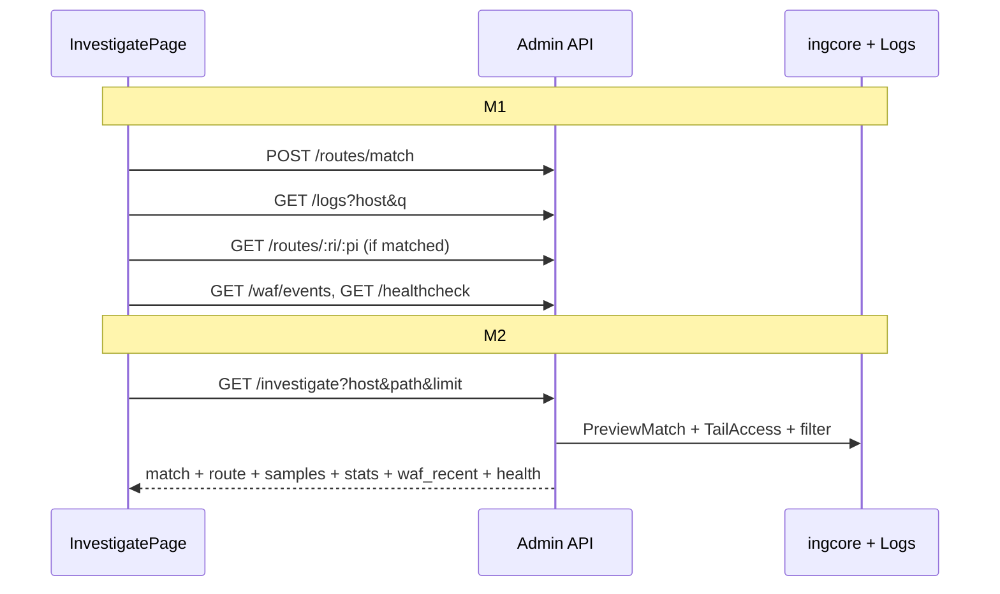

# feat: Request Investigator (admin console)

## Problem

Operators investigating slow requests, 5xx spikes, WAF blocks, or routing mismatches must jump across **总览 → 日志 → 路由试匹配 → WAF → 健康检查** and mentally correlate context. Deep links (Package A) reduced clicks but did not provide a **single investigation session** comparable to Kong Konnect Debugger or HAProxy Request Explorer.

## Goals

| ID | Goal |
|----|------|
| G1 | One page answers: **which route matched**, **what backend**, **recent samples**, **policy/health state** |
| G2 | Entry from overview, logs, WAF, events, route detail with **≤2 clicks** from anomaly to context |
| G3 | M2: structured samples with **ingress vs upstream latency** from access log tail fields |

## Non-goals (v1)

- OpenTelemetry / distributed tracing
- Request/response body capture
- Multi-cluster federation
- In-page config editing (link to `/config` only)
- M3 items: shareable investigation bookmarks, event runbook auto-fill, route sparklines (deferred)

## Requirements traceability

| Req | Source |
|-----|--------|
| R1 | Unified `/investigate` URL with host, path, optional method/status/ri/pi |
| R2 | Five UI zones: context bar, route verdict, samples, policy/health, actions |
| R3 | M1: parallel existing APIs; M2: `GET /api/v1/investigate` |
| R4 | Extend `AccessEntry` parser for target, client_ip, upstream_* |
| R5 | Rewire primary CTAs from overview/logs/WAF/events/route detail |

## High-level design

*Directional guidance for review — not implementation specification.*



Access log shape (already emitted by `core/accesslog.go`):

```
{client_ip} {host} -> {target} "{method} {path} {proto}" {status} {duration_ms} cache_hit=… upstream_status=… upstream_response_time=…
```

Parser today (`core/admin/service/accesslog.go`) only fills host, method, path, status, duration, cache_hit, waf_block — M2 extends this before aggregation.

## Output structure (new files)

```
core/admin/
  handler/investigate.go          # M2
  service/investigate.go          # M2
  service/investigate_test.go     # M2
  service/accesslog.go            # extend AccessEntry
  service/accesslog_test.go       # new cases
core/admin/web/src/
  pages/InvestigatePage.tsx       # M1
  components/investigate/         # M1 (optional split)
    InvestigateContextBar.tsx
    InvestigateMatchPanel.tsx
    InvestigateSamplesTable.tsx
    InvestigatePolicyPanel.tsx
    InvestigateLatencyBar.tsx     # M2
  lib/deepLinks.ts                # investigateLink()
  lib/investigateCompose.ts       # M1 client-side aggregator
  api/client.ts                   # types + investigate()
```

## Implementation units

### U1. Routing, deep links, and navigation

- **Goal:** `/investigate` is reachable and linkable from the app shell.
- **Requirements:** R1
- **Dependencies:** none
- **Files:**
  - `core/admin/web/src/lib/deepLinks.ts` — add `investigateLink({ host, path, method?, status?, ri?, pi?, client_ip? })`
  - `core/admin/web/src/App.tsx` — route `investigate` → `InvestigatePage`
  - `core/admin/web/src/layout/navConfig.tsx` — **监控** group: add「调查」between 事件 and 日志 (or after 事件)
  - `core/admin/web/src/styles/app.css` — `.investigate-*` layout primitives (can be minimal in U1, expanded in U2)
- **Approach:** Mirror `logsLink` / `wafLink` query param conventions. Path-only matching uses `path` query; logs filter continues to use `q` internally when linking out to `/logs`.
- **Patterns:** `core/admin/web/src/lib/deepLinks.ts`, `RoutesPage` tab query pattern
- **Test scenarios:**
  - `investigateLink({ host: 'a.com', path: '/x' })` → `/investigate?host=a.com&path=%2Fx`
  - Optional `ri`/`pi` encoded when provided
- **Verification:** Manual: nav item loads empty state; URL paste with host+path loads page shell.

---

### U2. Investigate page — M1 client compose

- **Goal:** Full five-zone UI using **existing APIs only** (no new backend).
- **Requirements:** R2, R3 (M1), R5 (partial — page exists; entry rewiring in U3)
- **Dependencies:** U1
- **Files:**
  - `core/admin/web/src/pages/InvestigatePage.tsx`
  - `core/admin/web/src/lib/investigateCompose.ts` — `loadInvestigateContext(host, path, opts)` orchestrating:
    - `api.match(host, path)` unless `ri`/`pi` in URL
    - `api.logs({ log: 'access', host, q: path, limit: 50 })` for samples (raw lines OK in M1)
    - `api.routeDetail(ri, pi)` when matched
    - `api.wafEvents({ host, path, action: 'block', limit: 5 })`
    - `api.healthCheck()` filtered client-side by host (+ path prefix if check exposes path)
  - `core/admin/web/src/api/client.ts` — export types reused by panels; no `investigate()` yet
  - Optional split under `core/admin/web/src/components/investigate/`
  - `core/admin/web/src/styles/app.css` — zones: context bar, verdict card, samples table, policy grid, action row
- **Approach:**
  - Read `useSearchParams` on mount; show loading/error/empty (missing host or path).
  - **Zone ②:** Render `MatchPreview` like `RouteMatchTab`; link to `routeDetailLink` when `matched`.
  - **Zone ③:** Table from log lines — parse status/duration with simple regex client-side OR display raw lines with `logLineClass` from `LogsPage`.
  - **Zone ④:** Cards from route detail (cache, auth, waf patched, health) + WAF recent list.
  - **Zone ⑤:** `logsLink`, `wafLink`, `routesTabLink('topology')`, `configLink` — same as route detail actions.
  - Manual refresh button; no SSE in M1.
- **Patterns:** `RouteDetailPage.tsx`, `EventsPage.tsx`, `RouteMatchTab.tsx`
- **Test scenarios:**
  - Test expectation: none for TSX — manual checklist below
- **Verification (manual):**
  - `/investigate?host=api.example.com&path=/v2/users` with demo config shows match + log samples
  - Unmatched host shows `MatchPreview.matched === false` message + still shows log samples if any
  - `?ri=0&pi=1` skips match call, loads route detail directly

---

### U3. Entry-point rewiring

- **Goal:** Primary anomaly CTAs open investigator instead of bare logs.
- **Requirements:** R5
- **Dependencies:** U1, U2
- **Files:**
  - `core/admin/web/src/components/OverviewAttentionPanel.tsx` — slow/error items → `investigateLink`
  - `core/admin/web/src/pages/LogsPage.tsx` — per-line or toolbar「调查」with host+path parsed from line (best-effort regex)
  - `core/admin/web/src/pages/WAFPage.tsx` — event row action → investigate with host, path, optional event context
  - `core/admin/web/src/lib/buildEventsFeed.ts` — WAF/health `href` / `actions` prefer investigate where appropriate
  - `core/admin/web/src/pages/RouteDetailPage.tsx` — primary CTA「调查此路由」; keep secondary 日志/WAF as ghost buttons
- **Approach:** Do not remove `logsLink`/`wafLink`; investigator becomes **default**, logs remain drill-down.
- **Test scenarios:** Test expectation: none — visual/regression pass
- **Verification:** From overview slow-request link lands on investigate with correct query; back navigation sane.

---

### U4. Access log parser extension

- **Goal:** `ParseAccessEntry` extracts fields needed for M2 samples and latency bar.
- **Requirements:** R4, G3
- **Dependencies:** none (can parallelize with U2)
- **Files:**
  - `core/admin/service/accesslog.go` — extend `AccessEntry`:
    - `ClientIP`, `Target`, `UpstreamStatus`, `UpstreamDurationMs`
  - `core/admin/service/accesslog_test.go` — cases from `core/accesslog_test.go` demo line with full tail fields
- **Approach:**
  - After existing `reRequest` match, parse `-> {target}` from arrow segment (already partially available via line prefix).
  - Regex tail: `upstream_status=(\d+)`, `upstream_response_time=(\d+)ms`, leading client IP before host.
  - Keep backward compatibility: old lines without upstream fields still parse.
- **Execution note:** Extend `TestParseAccessLine` before changing aggregation logic.
- **Test scenarios:**
  - Full demo line from `TestFormatAccessLog_demoShape` parses Target=`api.internal:8080`, UpstreamDurationMs=12
  - Line without upstream tail fields: ok=true, upstream fields zero/empty
  - Admin API log lines (`GET /api/v1/...`) still skipped (host empty or no match)
- **Verification:** `go test ./core/admin/service/... -run ParseAccess`

---

### U5. Investigate API — M2 backend

- **Goal:** Single endpoint returns investigation context for the UI.
- **Requirements:** R3 (M2), R4
- **Dependencies:** U4
- **Files:**
  - `core/admin/service/investigate.go` — `Investigate(ctx InvestigateQuery) (InvestigateResult, error)`
  - `core/admin/service/investigate_test.go`
  - `core/admin/handler/investigate.go` — `GET /investigate` query bind
  - `core/admin/handler/api.go` — mount route **before** `/routes/:ri/:pi` to avoid param shadowing (or use distinct path `/investigate` with no conflict)
- **Approach:**
  - Query: `host` (required), `path` (required), `method` (optional filter), `limit` (default 20, max 100), `ri`/`pi` (optional).
  - Load config → `ingcore.PreviewMatch` unless ri/pi provided.
  - `logs.TailAccess(5000)` → filter: equal fold host, path prefix match (same as `aggregateRouteMetrics` in `core/admin/handler/route_detail.go`).
  - Build `samples[]` from extended `AccessEntry`, newest first, cap limit.
  - `stats`: count, error_rate, p95 from samples window (reuse percentile helper from `service` package).
  - `waf_recent`: audit query host+path limit 5 block events.
  - `health`: find check matching host/backend key used by `HealthCheckService`.
  - `route`: call shared `buildRouteDetail` logic (extract from handler to service if needed to avoid duplication — **deferred detail**: may duplicate minimal zoox.H build in investigate service mirroring route_detail).
- **Patterns:** `core/admin/handler/route_detail.go` (`aggregateRouteMetrics`), `core/admin/handler/api.go` (`Match`)
- **Test scenarios:**
  - `Investigate` with known host/path returns `match.matched=true` and non-empty samples from fixture lines
  - Missing host → error
  - Unmatched host → `match.matched=false`, samples still populated if logs exist
  - Sample includes `upstream_duration_ms` when log line contains tail fields
  - `limit=5` returns at most 5 samples
- **Verification:** `go test ./core/admin/service/... -run Investigate`; curl `GET /api/v1/investigate?host=...&path=...`

---

### U6. Investigate page — M2 API + latency bar

- **Goal:** Frontend uses unified API; show ingress vs upstream latency for anchor/sample row.
- **Requirements:** G3, R3 (M2)
- **Dependencies:** U2, U5
- **Files:**
  - `core/admin/web/src/api/client.ts` — `InvestigateResult` type, `api.investigate(params)`
  - `core/admin/web/src/pages/InvestigatePage.tsx` — switch to `api.investigate`; remove or gate `investigateCompose` behind fallback flag
  - `core/admin/web/src/components/investigate/InvestigateLatencyBar.tsx` — visual bar: total ms vs upstream ms (gap labeled「网关内」)
  - `core/admin/web/src/components/investigate/InvestigateSamplesTable.tsx` — structured columns: time, status, duration, upstream, cache, waf
  - `core/admin/static/dist/*` — rebuild via `make -C core/admin web` before release
- **Approach:**
  - Highlight row matching URL `status` + closest duration if anchor params present.
  - If `upstream_duration_ms` missing, hide bar and show hint「仅总耗时（日志无 upstream 字段）」.
- **Test scenarios:** Test expectation: none TSX — manual + API contract test via U5
- **Verification:** M2 page loads in &lt;1s on demo access.log; waterfall visible on proxy lines with upstream fields.

---

## Sequencing and PR strategy

| PR | Units | Ship criteria |
|----|-------|---------------|
| PR1 | U1 + U2 + U3 | M1 demo: compose APIs, all entry points, `pnpm run build` |
| PR2 | U4 + U5 | Backend tests green; API documented in plan only (optional `AGENTS.md` admin bullet) |
| PR3 | U6 | UI on unified API; remove dead compose code; dist rebuilt |

Recommended commit order within PR1: U1 → U2 → U3.

## Verification (release)

From repo root:

```bash
go test ./core/admin/...
cd core/admin/web && pnpm run build
make -C core/admin build   # if embedding dist
```

Manual smoke (`examples/admin-console/ingress.yaml`):

1. Open `/investigate?host=<demo-host>&path=<demo-path>`
2. Confirm match card, ≥1 sample, policy section
3. Click through from overview attention item
4. M2: confirm `GET /api/v1/investigate` JSON shape in network tab

## Risks and mitigations

| Risk | Mitigation |
|------|------------|
| Log parse misses zoox-prefixed lines | Reuse existing `reLogTime` / `reLogLev` stripping; add fixture from real `examples/admin-console/access.log` snippet in U4 tests only (do not commit huge log) |
| `TailAccess(5000)` slow on large files | Cap scan; document; later: indexed log reader (deferred) |
| Route detail duplication in investigate service | Accept small duplication in M2; refactor `buildRouteDetail` to shared package in follow-up |
| LogsPage line → host/path parse fragile | Best-effort; button only shown when parse succeeds |

## Deferred to follow-up work (M3+)

- Copy「调查链接」to clipboard
- Events runbook templates pre-filling investigate URL
- Route-level sparkline on investigate page (`routes/:ri/:pi/metrics`)
- Saved investigation history (localStorage)
- Refactor `buildRouteDetail` into `core/admin/service` shared helper

## Documentation (optional, post-PR3)

- `AGENTS.md` Admin console section: one bullet on `/investigate` and API
- `docs/guide/admin-console.md` if exists — add「请求调查」subsection with screenshot placeholder

## Open questions (resolved)

| Question | Decision |
|----------|------------|
| M1 vs unified API first? | **Both:** M1 compose (U2), then M2 API (U5–U6) |
| Nav label | 「调查」under 监控 |
| New backend route path | `GET /api/v1/investigate` |

No further planning blockers — ready for `ce-work` execution starting at **U1**.
